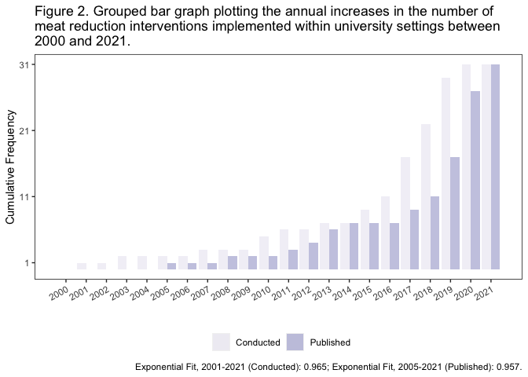
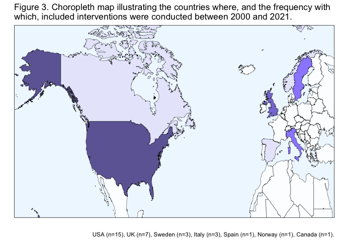
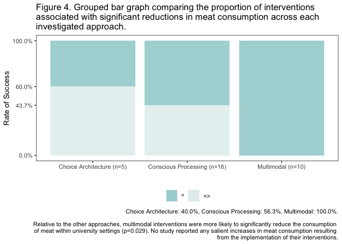
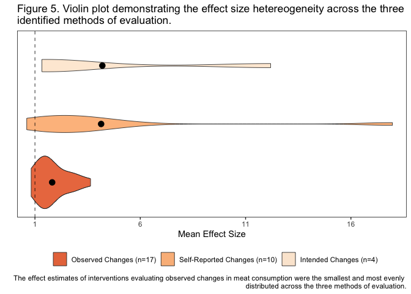
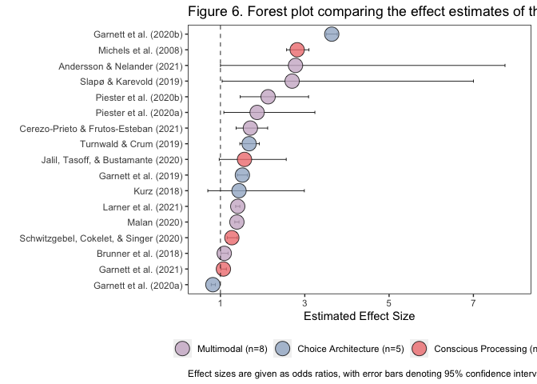
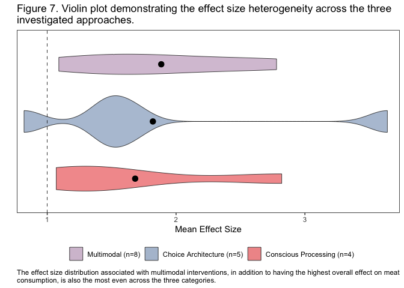

Visuals
================
Last updated: February 13, 2023

## Required packages

``` r
library(ggplot2)
library(tibble)
library(ggsignif)
library(DiagrammeR)
library(maps)
```

## Loading in the dataset

The dataset used for this project can be found in this project’s
repository under the `data` folder as `sr-dataset.cv`. It can be
imported into your environment using the following code chunk:

``` r
sr.dataset <- read.csv("~/github/university-meat-reduction/data/sr-dataset.csv")

print(as_tibble(sr.dataset))
```

    ## # A tibble: 31 × 18
    ##    study.title   country year.…¹ year.…² eval.…³ appro…⁴ outco…⁵ effec…⁶ effec…⁷
    ##    <chr>         <chr>     <int>   <int> <chr>   <chr>   <chr>   <chr>     <dbl>
    ##  1 Andersson & … Sweden     2021    2019 Betwee… Multim… Observ… ^          2.78
    ##  2 Brunner et a… Sweden     2018    2016 Pre-Po… Multim… Observ… ^          1.09
    ##  3 Campbell-Arv… USA        2011    2010 Betwee… Multim… Intend… ^         12.2 
    ##  4 Carfora et a… Italy      2019    2018 Both    Consci… Self-R… ^          2.59
    ##  5 Carfora, Cas… Italy      2017    2016 Both    Consci… Self-R… ^          3.49
    ##  6 Carfora, Cas… Italy      2017    2015 Both    Consci… Self-R… ^          3.73
    ##  7 Cerezo-Priet… Spain      2021    2020 Pre-Po… Multim… Observ… ^          1.71
    ##  8 Dissen & Cro… USA        2020    2019 Both    Consci… Self-R… ^          3.2 
    ##  9 Garnett et a… England    2019    2017 Betwee… Choice… Observ… ^          1.52
    ## 10 Garnett et a… England    2020    2017 Betwee… Choice… Observ… <>         0.82
    ## # … with 21 more rows, 9 more variables: lower.ci <dbl>, higher.ci <dbl>,
    ## #   num.strat <int>, inform.mess <int>, financial.inc <int>, menu.pres <int>,
    ## #   area.layout <int>, menu.off <int>, num.study <int>, and abbreviated
    ## #   variable names ¹​year.pub, ²​year.cond, ³​eval.method, ⁴​approach,
    ## #   ⁵​outcome.var, ⁶​effect.dir, ⁷​effect.mag

## Reporting on search results

An adapted version of the PRISMA 2020 flow diagram template has been
provided in the `figures` folder of this repository.

## Exploring the implementation and publication rates of included studies

First, we’ll have to load in the transformed dataset documenting the
cumulative frequency with which the included studies were conducted and
published by year.

``` r
times.series <- read.csv("~/github/university-meat-reduction/data/time-series.csv")
```

``` r
ggplot(times.series,aes(x=year,y=cumul.freq,fill=fill)) +
  geom_col(position="dodge",alpha=0.8) +
  scale_fill_brewer(palette="Purples",guide=guide_legend(title=NULL)) +
  scale_x_continuous(breaks=c(2000,2001,2002,2003,2004,2005,2006,2007,2008,2009,2010,2011,2012,2013,2014,2015,2016,2017,2018,2019,2020,2021)) +
  xlab(" ") +
  ylab("Cumulative Frequency") +
  labs(caption="Exponential Fit, 2001-2021 (Conducted): 0.965; Exponential Fit, 2005-2021 (Published): 0.957.") + 
  scale_y_continuous(breaks=c(1,11,21,31)) +
  ggtitle("Figure 2. Grouped bar graph plotting the annual increases in the number of \nmeat reduction interventions implemented within university settings between \n2000 and 2021.") +
  theme(axis.text.x=element_text(angle=30,hjust=1,vjust=1),panel.background=element_blank(),legend.position="bottom",panel.border=element_rect(fill=NA))
```

<!-- -->

## Looking at geospatial variation across studies

``` r
intervention_map <- map_data("world", region=c("Albania","Algeria","Austria","Belarus","Belgium","Bosnia and Herzegovina","Bulgaria","Chad","Croatia","Czech Republic","Denmark","Egypt","Eritrea","Estonia","Finland","France","Germany","Greece","Hungary","Iceland","Ireland","Latvia","Libya","Lithuania","Luxembourg","Mali","Mauritania","Mexico","Moldova","Montenegro","Morocco","Netherlands","Niger","North Macedonia","Poland","Portugal","Romania","Russia","Serbia","Slovakia","Slovenia","Sudan","Switzerland","Tunisia","Turkey","Ukraine","Canada","Norway","Spain","Italy","Sweden","UK","USA"))
```

``` r
ggplot(intervention_map,aes(x=long,y=lat,group=group,fill=region)) +
  geom_polygon(color="black",size=.15,alpha=0.8) +
  scale_fill_manual(values=c("white","white","white","white","white","white","white","white","white","white","white","white","white","white","white","white","white","white","white","white","white","white","white","white","white","white","white","white","white","white","white","white","white","white","white","white","white","white","white","white","white","white","white","white","white","white","lavender","lavender","lavender","lightslateblue","lightslateblue","slateblue","slateblue4"),limits=c("Albania","Algeria","Austria","Belarus","Belgium","Bosnia and Herzegovina","Bulgaria","Chad","Croatia","Czech Republic","Denmark","Egypt","Eritrea","Estonia","Finland","France","Germany","Greece","Hungary","Iceland","Ireland","Latvia","Libya","Lithuania","Luxembourg","Mali","Mauritania","Mexico","Moldova","Montenegro","Morocco","Netherlands","Niger","North Macedonia","Poland","Portugal","Romania","Russia","Serbia","Slovakia","Slovenia","Sudan","Switzerland","Tunisia","Turkey","Ukraine","Canada","Norway","Spain","Italy","Sweden","UK","USA"),breaks=c("Albania","Algeria","Austria","Belarus","Belgium","Bosnia and Herzegovina","Bulgaria","Chad","Croatia","Czech Republic","Denmark","Egypt","Eritrea","Estonia","Finland","France","Germany","Greece","Hungary","Iceland","Ireland","Latvia","Libya","Lithuania","Luxembourg","Mali","Mauritania","Mexico","Moldova","Montenegro","Morocco","Netherlands","Niger","North Macedonia","Poland","Portugal","Romania","Russia","Serbia","Slovakia","Slovenia","Sudan","Switzerland","Tunisia","Turkey","Ukraine","Canada","Norway","Spain","Italy","Sweden","UK","USA"),labels=c("Albania\n(n=0)","Algeria\n(n=0)","Austria\n(n-0)","Belarus\n(n=0)","Belgium\n(n=0)","Bosnia and Herzegovina\n(n=0)","Bulgaria\n(n=0)","Chad\n(n=0)","Croatia\n(n=0)","Czech Republic\n(n=0)","Denmark\n(n=0)","Egypt\n(n=0)","Eritrea\n(n=0)","Estonia\n(n=0)","Finland\n(n=0)","France\n(n=0)","Germany\n(n=0)","Greece\n(n=0)","Hungary\n(n=0)","Iceland\n(n=0)","Ireland\n(n=0)","Latvia\n(n=0)","Libya\n(n=0)","Lithuania\n(n=0)","Luxembourg\n(n=0)","Mali\n(n=0)","Mauritania\n(n=0)","Mexico\n(n=0)","Moldova\n(n=0)","Montenegro\n(n=0)","Morocco\n(n=0)","Netherlands\n(n=0)","Niger\n(n=0)","North Macedonia\n(n=0)","Poland\n(n=0)","Portugal\n(n=0)","Romania\n(n=0)","Russia\n(n=0)","Serbia\n(n=0)","Slovakia\n(n=0)","Slovenia\n(n=0)","Sudan\n(n=0)","Switzerland\n(n=0)","Tunisia\n(n=0)","Turkey\n(n=0)","Ukraine\n(n=0)","Canada\n(n=1)","Norway\n(n=1)","Spain\n(n=1)","Italy\n(n=3)","Sweden\n(n=3)","UK\n(n=7)","USA\n(n=15)"),guide=guide_legend(title=NULL,nrow=2)) +
  xlab(" ") + 
  ylab(" ") +
  guides(fill="none") +
  labs(caption="USA (n=15), UK (n=7), Sweden (n=3), Italy (n=3), Spain (n=1), Norway (n=1), Canada (n=1).") + 
  coord_cartesian(xlim=c(-162,29),ylim=c(22,76)) +
  ggtitle("Figure 3. Choropleth map illustrating the countries where, and the frequency with \nwhich, included interventions were conducted between 2000 and 2021.") +
  theme(axis.ticks=element_blank(),axis.text=element_blank(),panel.border=element_rect(fill=NA),legend.position="bottom",panel.grid=element_blank(),panel.background=element_rect(fill="aliceblue"))
```

    ## Warning: Using `size` aesthetic for lines was deprecated in ggplot2 3.4.0.
    ## ℹ Please use `linewidth` instead.

<!-- -->

## Comparing success rates across the three identified approaches

``` r
ggplot(sr.dataset,aes(x=approach,y=num.study,fill=effect.dir)) + 
  geom_col(position="fill",alpha=.8) + 
  scale_fill_manual(values=c("paleturquoise3","azure2"),guide=guide_legend(title=NULL)) +
  scale_x_discrete(labels=c("Choice Architecture (n=5)","Conscious Processing (n=16)","Multimodal (n=10)")) +
  scale_y_continuous(labels=scales::percent_format(.1L),breaks=c(1,.6,.437,0)) +
  xlab(" ") + 
  ylab("Rate of Success") +
  labs(caption="Choice Architecture: 40.0%, Conscious Processing: 56.3%, Multimodal: 100.0%.\n\nRelative to the other approaches, multimodal interventions were more likely to significantly reduce the consumption \nof meat within university settings (p=0.029). No study reported any salient increases in meat consumption resulting \nfrom the implementation of their interventions.") + 
  ggtitle("Figure 4. Grouped bar graph comparing the proportion of interventions \nassociated with significant reductions in meat consumption across each \ninvestigated approach.") +
  theme(legend.position="bottom",panel.border=element_rect(fill=NA),panel.background=element_blank())
```

<!-- -->

## Illustrating effect size heterogeneity

``` r
ggplot(sr.dataset,aes(x=effect.mag,y=outcome.var,fill=outcome.var)) +
  geom_violin(adjust=1.6,alpha=0.8,size=.3) + 
  stat_summary(fun="mean",geom="point",shape=21,fill="black",size=3) +
  scale_y_discrete(limits=c("Observed Changes","Self-Reported Changes","Intended Changes")) +
  scale_fill_brewer(palette="Oranges",limits=c("Intended Changes","Self-Reported Changes","Observed Changes"),breaks=c("Observed Changes","Self-Reported Changes","Intended Changes"),labels=c("Observed Changes (n=17)","Self-Reported Changes (n=10)","Intended Changes (n=4)")) +
  xlab("Mean Effect Size") + 
  ylab(" ") +
  labs(fill=" ") +
  scale_x_continuous(breaks=c(1,6,11,16)) +
  coord_cartesian(xlim=c(1,17.8)) +
  labs(caption="The effect estimates of interventions evaluating observed changes in meat consumption were the smallest and most evenly \ndistributed across the three methods of evaluation.") + 
  ggtitle("Figure 5. Violin plot demonstrating the effect size hetereogeneity across the three \nidentified methods of evaluation.") +
  geom_vline(xintercept=1,color="black",size=.3,linetype=2) +
  theme(legend.position="bottom",panel.border=element_rect(fill=NA),panel.background=element_blank(),axis.ticks.y=element_blank(),axis.text.y=element_blank(),panel.grid.minor=element_blank())
```

<!-- -->

## Creating a dataframe for the fixed effect model

``` r
fixed.effect <- filter(sr.dataset,outcome.var=="Observed Changes")
```

``` r
write.csv(fixed.effect,"~/github/university-meat-reduction/data/fixed-effect.csv")
```

``` r
fixed.effect <- read.csv("~/github/university-meat-reduction/data/fixed-effect.csv")

print(as_tibble(fixed.effect))
```

    ## # A tibble: 17 × 18
    ##        X study…¹ country year.…² eval.…³ appro…⁴ outco…⁵ effec…⁶ effec…⁷ lower…⁸
    ##    <int> <chr>   <chr>     <int> <chr>   <chr>   <chr>   <chr>     <dbl>   <dbl>
    ##  1     1 Anders… Sweden     2019 Betwee… Multim… Observ… ^          2.78    1   
    ##  2     2 Brunne… Sweden     2016 Pre-Po… Multim… Observ… ^          1.09    1.01
    ##  3     3 Cerezo… Spain      2020 Pre-Po… Multim… Observ… ^          1.71    1.37
    ##  4     4 Garnet… England    2017 Betwee… Choice… Observ… ^          1.52    1.4 
    ##  5     5 Garnet… England    2017 Betwee… Choice… Observ… <>         0.82    0.78
    ##  6     6 Garnet… England    2018 Betwee… Choice… Observ… ^          3.64    3.51
    ##  7     7 Garnet… England    2018 Pre-Po… Consci… Observ… <>         1.07    1.01
    ##  8     8 Jalil,… USA        2019 Both    Consci… Observ… <>         1.57    0.97
    ##  9     9 Kurz (… Sweden     2015 Both    Choice… Observ… <>         1.44    0.7 
    ## 10    10 Larner… England    2019 Pre-Po… Multim… Observ… ^          1.41    1.36
    ## 11    11 Malan … USA        2019 Both    Multim… Observ… ^          1.39    1.34
    ## 12    12 Michel… USA        2001 Pre-Po… Consci… Observ… ^          2.82    2.57
    ## 13    13 Pieste… USA        2019 Betwee… Multim… Observ… ^          1.87    1.08
    ## 14    14 Pieste… USA        2019 Betwee… Multim… Observ… ^          2.13    1.47
    ## 15    15 Schwit… USA        2017 Both    Consci… Observ… ^          1.27    1.16
    ## 16    16 Slapø … Norway     2018 Pre-Po… Multim… Observ… ^          2.7     1.04
    ## 17    17 Turnwa… USA        2017 Betwee… Choice… Observ… <>         1.68    1.46
    ## # … with 8 more variables: higher.ci <dbl>, num.strat <int>, inform.mess <int>,
    ## #   financial.inc <int>, menu.pres <int>, area.layout <int>, menu.off <int>,
    ## #   num.study <int>, and abbreviated variable names ¹​study.title, ²​year.cond,
    ## #   ³​eval.method, ⁴​approach, ⁵​outcome.var, ⁶​effect.dir, ⁷​effect.mag, ⁸​lower.ci

## Comparing the estimated effect sizes across individual studies

``` r
ggplot(fixed.effect,aes(x=effect.mag,y=study.title,fill=approach)) + 
  geom_errorbar(aes(xmin=lower.ci,xmax=higher.ci),color="black",width=.2,size=.3) +
  geom_point(alpha=.8,size=6,shape=21) + 
  xlab("Estimated Effect Size") + 
  ylab(" ") + 
  scale_x_continuous(breaks=c(1,3,5,7),limits=c(.6,8)) +
  labs(color=" ") +
  scale_fill_manual(guide=guide_legend(title=NULL),breaks=c("Multimodal","Choice Architecture","Conscious Processing"),values=c("thistle3","lightsteelblue3","lightcoral"),labels=c("Multimodal (n=8)","Choice Architecture (n=5)","Conscious Processing (n=4)")) +
  scale_y_discrete(limits=c("Garnett et al. (2020a)","Garnett et al. (2021)","Brunner et al. (2018)","Schwitzgebel, Cokelet, & Singer (2020)","Malan (2020)","Larner et al. (2021)","Kurz (2018)","Garnett et al. (2019)","Jalil, Tasoff, & Bustamante (2020)","Turnwald & Crum (2019)","Cerezo-Prieto & Frutos-Esteban (2021)","Piester et al. (2020a)","Piester et al. (2020b)","Slapø & Karevold (2019)","Andersson & Nelander (2021)","Michels et al. (2008)","Garnett et al. (2020b)")) + 
  labs(caption="Effect sizes are given as odds ratios, with error bars denoting 95% confidence intervals.") + 
  ggtitle("Figure 6. Forest plot comparing the effect estimates of the 17 studies included in the fixed effect model.") +
  geom_vline(xintercept=1,color="black",size=.3,linetype=2) +
  theme(plot.caption=element_text(hjust=0),legend.position="bottom",panel.background=element_blank(),panel.border=element_rect(fill=NA),panel.grid.minor=element_blank())
```

<!-- -->

## Comparing effect estimates across the three identified approaches

``` r
ggplot(fixed.effect,aes(x=effect.mag,y=approach,fill=approach)) +
  geom_violin(adjust=1.2,alpha=0.8,size=.3) + 
  stat_summary(fun="mean",geom="point",shape=21,fill="black",size=3) +
  scale_y_discrete(limits=c("Conscious Processing","Choice Architecture","Multimodal")) +
  scale_fill_manual(values=c("thistle3","lightsteelblue3","lightcoral"),breaks=c("Multimodal","Choice Architecture","Conscious Processing"),labels=c("Multimodal (n=8)","Choice Architecture (n=5)","Conscious Processing (n=4)")) +
  xlab("Mean Effect Size") + 
  ylab(" ") +
  labs(fill=" ") +
  labs(caption="The effect size distribution associated with multimodal interventions, in addition to having the highest overall effect on meat \nconsumption, is also the most even across the three categories.") + 
  ggtitle("Figure 7. Violin plot demonstrating the effect size heterogeneity across the three \ninvestigated approaches.") +
  coord_cartesian(xlim=c(.9,3.6)) +
  geom_vline(xintercept=1,color="black",size=.3,linetype=2) +
  theme(plot.caption=element_text(hjust=0),legend.position="bottom",panel.border=element_rect(fill=NA),panel.background=element_blank(),axis.ticks.y=element_blank(),axis.text.y=element_blank(),panel.grid.minor=element_blank())
```

<!-- -->
